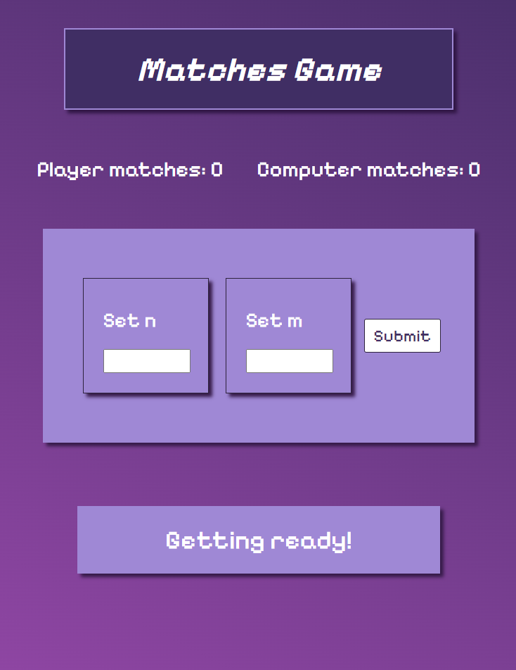
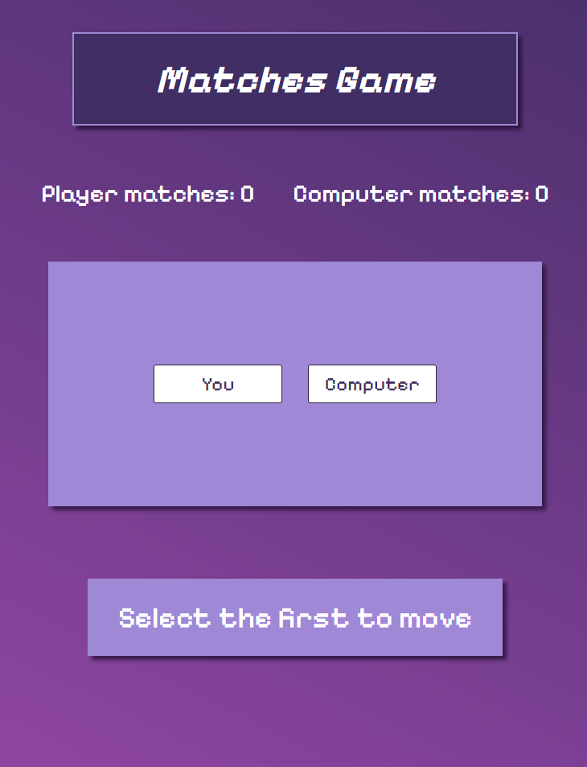
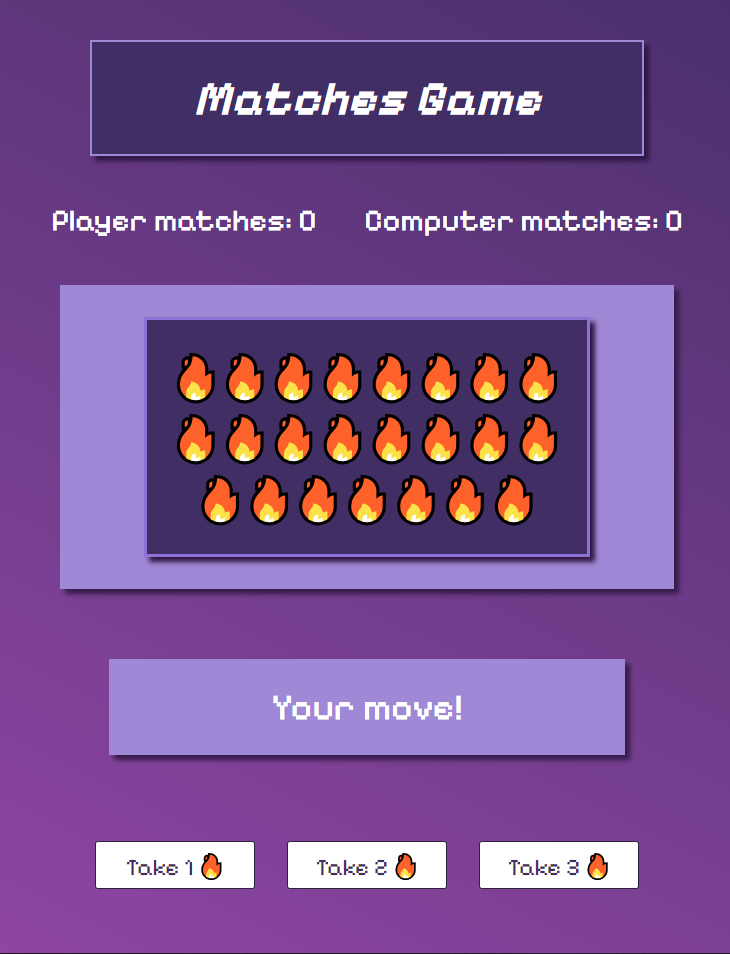
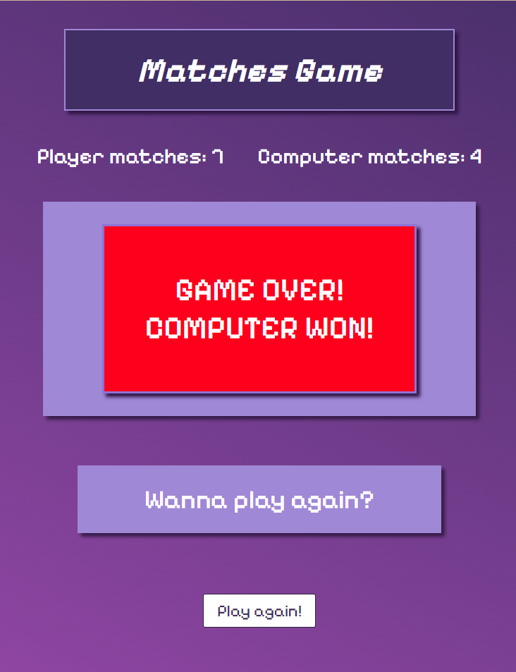

# Matches game
___

## Description

This game was created as a test task for the React Native Internship at Stormotion.
I didn't use any libraries or frameworks. Only pure JavaScript, HTML and CSS.
___

## Rules

The rules ot this game are simple. You are playing against the computer.
From the pile of `2 * n + 1` matches, each player takes either 1, 2, ..., `m` 
matches on each turn. The game is over once all matches are taken. Whoever has the
even amount of matches wins.
___

## How to start playing

First of all you need to clone this repository:

`git clone https://github.com/koksha19/matches-game.git`

After that you have to run index.html file on your local server. For example, you
can open this project in your IDE, right click on `index.html` and open it in your
browser.
___

After that you can start playing. You will be asked to enter `n` and `m`, where
`2 * n + 1` is the total amount of matches and  the number of matches allowed to 
take on each turn is from 1 to `m`.

___

After that you can choose who will make the first move.

___

After that the game starts.

___

If you enjoyed the game you can play again.

